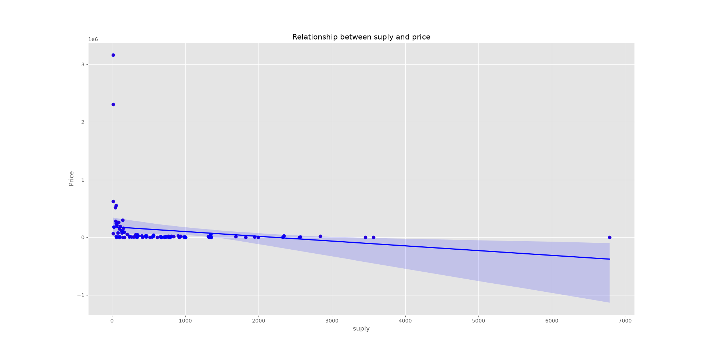

# Market Price Prediction with Linear Regression

A machine learning model for predicting market prices and analyzing the relationship between supply, demand, and price using linear regression.

## What does the project do?

This project uses supply and demand data to predict market prices using a Linear Regression model.

It also visualizes the relationships between:
- Supply and price
- Demand and price

The project includes data cleaning, data visualization, model training, and price prediction.

## Dataset

The dataset is synthetic and was created for educational purposes.

It contains two main features:
- Supply
- Demand

The target variable is:
- Price

The price data is generated from the relationship between demand and supply, with a small amount of random noise.

## Data Cleaning

Before training the model, invalid data is removed.

Values where supply or demand are zero or negative are removed because they are not suitable for this dataset.

These cleaning and dataset-design choices are intentional because the dataset is synthetic.

## Data Visualization

The project uses Matplotlib and Seaborn to visualize the data.

### Supply vs Price

This chart shows the relationship between supply and price.



### Demand vs Price

This chart shows the relationship between demand and price.


The individual relationships can show substantial dispersion. This does not necessarily mean that the model or dataset is poor, because the final Linear Regression model uses both supply and demand together.

## Machine Learning Model

The project uses `LinearRegression` from Scikit-learn.

The model uses:

- Supply
- Demand

as input features and predicts:

- Market Price

The model learns coefficients for the features and an intercept to make predictions.

## Predictions

The trained model is used to predict prices for different combinations of supply and demand.

For example, the project tests different scenarios such as:

- Supply = 500, Demand = 300
- Supply = 500, Demand = 600
- Supply = 500, Demand = 900
- Supply = 1000, Demand = 600
- Supply = 1000, Demand = 900

The project also compares the predictions from Scikit-learn with predictions calculated using the model's coefficients and intercept.

## Technologies Used

- Python
- NumPy
- Pandas
- Matplotlib
- Seaborn
- Scikit-learn

## Project Structure

```text
market-price-linear-regression/
├── sup dem Price.py
├── README.md
├── requirements.txt
├── supply_price.png
└── demand_price.png
```
